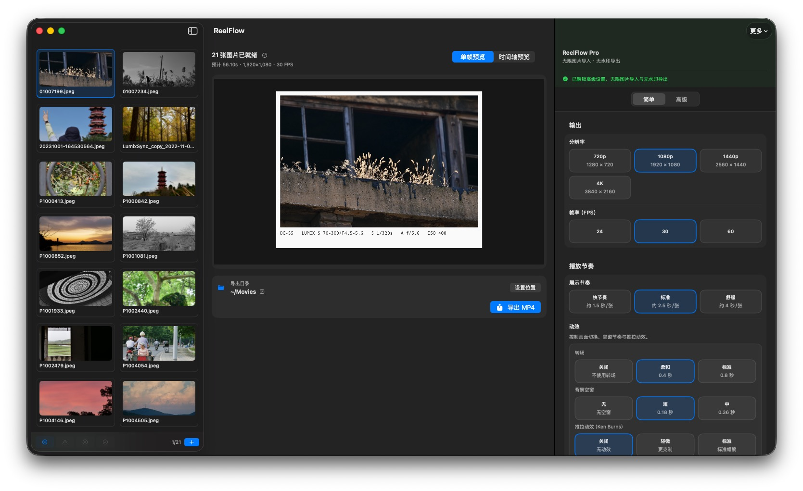

# ReelFlow

[English](README.md) | [简体中文](README.zh-CN.md)

ReelFlow 是一款原生 macOS 应用，用来把一组照片快速做成更完整、更有质感的幻灯片视频。它强调预览快、导出稳、控制足够细，但不会把用户拖进复杂的视频编辑流程里。

它面向摄影师、内容创作者，以及任何希望把静态照片整理成视频的人。你可以导入照片、预览结果、添加背景音乐、调整节奏和画面风格，最后导出 MP4。



主工作区界面：导入照片、调整参数、预览结果，并导出 MP4。

## 它能帮你做什么

ReelFlow 解决的是一个很多工具都处理得不够好的问题：把一组静态照片快速整理成一条干净、可交付、可分享的视频，而不需要从头做一条完整时间线。

典型使用场景：

- 做一个可交付的照片幻灯片视频
- 把一次拍摄、一组旅行照片或一个作品集做成动态展示
- 在不学习复杂剪辑软件的前提下，加入简单音乐和节奏控制
- 用更符合 macOS 使用习惯的方式快速导出视频

## 为什么用户会选择 ReelFlow

很多视频编辑器对于“照片转视频”这件事来说太重了，而很多一键式幻灯片工具又太弱、太模板化，或者导出过程不够稳定。

ReelFlow 聚焦在一个更窄但更常见的问题上：

- 导入照片后，尽快得到一个可用结果
- 让预览和导出尽量保持一致
- 在长时间导出前，先把高风险素材暴露出来
- 让第一次使用的人也能顺着主路径完成导出
- 专注于照片幻灯片，而不是变成一个完整视频编辑器

## 它为什么比普通幻灯片工具更舒服

- 原生 macOS 界面，而不是浏览器式包装
- 从导入到导出更直接
- 比模板型工具更可控
- 比完整时间线编辑器更容易上手
- 校验、恢复和导出诊断信息更清晰

## 核心工作流

1. 导入一组照片。
2. 调整时长、转场、布局和视觉风格。
3. 预览结果。
4. 如果需要，添加一条背景音轨。
5. 导出 MP4。

## 产品亮点

### 预览快，导出更可预期

- 支持单帧预览和时间轴预览
- 预览和导出尽量使用同一套核心参数
- 导出行为更稳定、更容易预测

### 面向照片的控制能力

- 支持拖拽导入照片
- 支持横图和竖图混排
- 支持画面方向策略控制
- 支持边距、边框和背景风格调整

### 音频

- 支持导入一条背景音轨
- 支持沿时间轴预览音频
- 支持导出带同步音频的视频

### 节奏与动态

- 支持幻灯片时长控制
- 支持转场时长控制
- 支持淡入淡出开关
- 渲染链路支持 Ken Burns 风格动态效果

### 导出前更安心

- 导出前预检
- 就地校验反馈
- 失败摘要与重试路径
- 支持导出诊断包，便于排查问题

## 免费版与 Pro

- 免费版：可导入有限数量的照片，预览和导出会带较轻的 ReelFlow 标记
- Pro：支持无限照片导入，并移除 ReelFlow 标记

## 运行要求

- macOS `14.6` 或更高版本

## 获取方式

ReelFlow 是一个开源产品，官方版本也可能继续通过商业方式分发，包括 Mac App Store。

这个仓库适合用来了解产品、跟踪演进，以及从源码自行构建。

## 开发者说明

### 技术栈

- Swift
- SwiftUI
- AVFoundation
- Core Image
- 原生 macOS 应用架构

### 从源码运行

```bash
git clone git@github.com:aruis/ReelFlow.git
cd ReelFlow
open ReelFlow.xcodeproj
```

然后在 Xcode 中构建并运行 `ReelFlow` scheme。

### 命令行构建

```bash
xcodebuild -project ReelFlow.xcodeproj -scheme ReelFlow build
```

## 测试

常用本地命令：

- `./scripts/test-non-ui.sh`
- `./scripts/test-audio-regression.sh`
- `./scripts/test-ui-smoke.sh`
- `./scripts/test-ci-gate.sh`
- `./scripts/release-gate.sh`

## 项目结构

- [`ReelFlow`](/Users/liurui/develop/workspace-xcode/ReelFlow/ReelFlow)：应用源码
- [`ReelFlowTests`](/Users/liurui/develop/workspace-xcode/ReelFlow/ReelFlowTests)：单元测试与集成测试
- [`ReelFlowUITests`](/Users/liurui/develop/workspace-xcode/ReelFlow/ReelFlowUITests)：UI smoke 测试
- [`scripts`](/Users/liurui/develop/workspace-xcode/ReelFlow/scripts)：本地测试与发布脚本
- [`Docs`](/Users/liurui/develop/workspace-xcode/ReelFlow/Docs)：更深入的产品、发布和工程文档

## 路线图

当前重点：

- 让预览与导出更稳定、更一致
- 提升真实照片集上的首次成功率
- 持续优化导出失败后的恢复与诊断体验
- 打磨更完整的发布与分发流程

后续方向：

- 更强的模板与预设能力
- 更丰富的幻灯片风格
- 更完整的打包与分发工作流

## 贡献

欢迎提交 issue 和 pull request，尤其是这几类方向：

- 导出稳定性
- 预览与导出一致性
- 可访问性与易用性
- 真实失败路径上的测试覆盖

如果改动范围较大，建议先开 issue 对齐范围和方向。

## 许可证

本项目使用 GNU GPLv3 许可证。

完整条款见 [LICENSE](/Users/liurui/develop/workspace-xcode/ReelFlow/LICENSE)。
